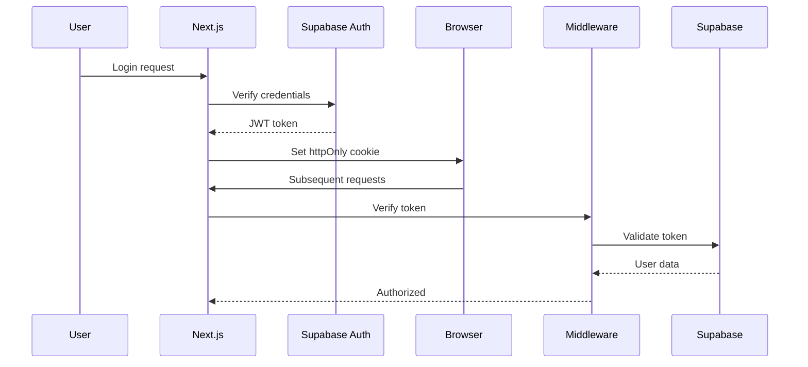

# Architettura Nuova Applicazione - ComUniMo Next.js

## 🏗️ Stack Tecnologico Completo

### Frontend Layer

#### Core Framework
```typescript
- Next.js 14.2+ (App Router)
  - React Server Components (RSC)
  - Server Actions per mutazioni
  - Streaming SSR
  - Incremental Static Regeneration (ISR)
  - Edge Runtime quando possibile

- React 18.3+
  - Concurrent Features
  - Suspense boundaries
  - Error boundaries
  - Custom hooks

- TypeScript 5.3+ (strict mode)
  - Zod per runtime validation
  - Type-safe API clients
  - Shared types frontend/backend
```

#### Styling & UI
```typescript
- Tailwind CSS 3.4+
  - Custom design system config
  - Dark mode support
  - Responsive utilities
  - Animation utilities

- shadcn/ui (Radix UI primitives)
  - Button, Input, Select, Dialog, etc.
  - Customizzabili con Tailwind
  - Accessibili di default (ARIA)

- Framer Motion
  - Animazioni fluide
  - Page transitions
  - Micro-interactions

- lucide-react
  - Icon library moderna
  - Tree-shakeable
```

#### State Management
```typescript
- React Query (TanStack Query v5)
  - Server state management
  - Caching intelligente
  - Optimistic updates
  - Infinite queries

- Zustand (se necessario)
  - Client state leggero
  - Alternative a Context API

- React Context
  - UI state globale
  - Theme, user preferences
```

#### Forms & Validation
```typescript
- React Hook Form
  - Performance ottimizzate
  - Uncontrolled components
  - Validation schema integration

- Zod
  - Schema validation
  - Type inference
  - Error messages personalizzati
```

#### Data Visualization
```typescript
- Recharts
  - Grafici dashboard admin
  - Responsive charts
  - Customizzabili

- date-fns
  - Date manipulation
  - Formatting locale-aware
```

### Backend Layer

#### Database & Backend as a Service
```typescript
- Supabase
  ├── PostgreSQL 15+
  │   ├── Relational data
  │   ├── Full-text search
  │   ├── JSON columns
  │   └── Triggers & Functions
  │
  ├── Auth
  │   ├── JWT tokens
  │   ├── Row Level Security (RLS)
  │   ├── Email/Password
  │   ├── Magic links
  │   └── OAuth (opzionale)
  │
  ├── Storage
  │   ├── File uploads (certificati, documenti)
  │   ├── Image transformation
  │   └── CDN integrato
  │
  ├── Realtime
  │   ├── Database changes subscription
  │   ├── Presence tracking
  │   └── Broadcast messages
  │
  └── Edge Functions (Deno)
      ├── Webhooks esterni
      ├── Processamento dati complesso
      ├── Integrazioni API terze parti
      └── Scheduled jobs
```

#### API Layer
```typescript
- Next.js API Routes (quando necessario)
  - /api/webhook/* (PayPal, SMS gateway)
  - /api/export/* (PDF, Excel generation)
  - /api/import/* (CSV parsing, validation)

- Server Actions
  - Form submissions
  - Data mutations
  - File uploads
  - Inline con componenti
```

#### Authentication & Authorization
```typescript
- Supabase Auth
  - JWT tokens in httpOnly cookies
  - Automatic token refresh
  - Session management

- Middleware Next.js
  - Route protection
  - Role-based access control (RBAC)
  - Redirect non-authenticated users

- Row Level Security (RLS)
  - Database-level authorization
  - Policy per tabella
  - User/role based policies
```

### DevOps & Infrastructure

#### Hosting & Deployment
```typescript
- Vercel
  ├── Automatic deployments
  ├── Preview deployments per PR
  ├── Edge Network (CDN globale)
  ├── Serverless Functions
  ├── Edge Functions
  └── Web Analytics

- Supabase Cloud
  ├── Database hosting
  ├── Automatic backups
  ├── Connection pooling
  └── Point-in-time recovery
```

#### CI/CD Pipeline
```yaml
- GitHub Actions
  - Lint & Format check (ESLint, Prettier)
  - Type checking (TypeScript)
  - Unit tests (Jest)
  - Integration tests (Playwright)
  - E2E tests (Playwright)
  - Build verification
  - Automatic deploy (Vercel)
  - Database migrations (Supabase)
```

#### Monitoring & Observability
```typescript
- Vercel Analytics
  - Web Vitals tracking
  - User analytics
  - Performance monitoring

- Supabase Logs
  - Database queries
  - Auth events
  - API requests

- Sentry (opzionale)
  - Error tracking
  - Performance monitoring
  - User feedback
```

## 📁 Struttura Progetto Next.js

```
comunimo-next/
├── .github/
│   └── workflows/
│       ├── ci.yml                  # CI pipeline
│       └── deploy.yml              # Deploy automation
│
├── app/                            # App Router (Next.js 14)
│   ├── (auth)/                     # Route group: auth
│   │   ├── login/
│   │   │   └── page.tsx
│   │   ├── register/
│   │   │   └── page.tsx
│   │   └── reset-password/
│   │       └── page.tsx
│   │
│   ├── (dashboard)/                # Route group: dashboard (protected)
│   │   ├── layout.tsx              # Dashboard layout con sidebar
│   │   ├── page.tsx                # Dashboard home
│   │   │
│   │   ├── atleti/                 # Gestione atleti
│   │   │   ├── page.tsx            # Lista atleti
│   │   │   ├── nuovo/
│   │   │   │   └── page.tsx
│   │   │   └── [id]/
│   │   │       ├── page.tsx        # Dettaglio atleta
│   │   │       └── modifica/
│   │   │           └── page.tsx
│   │   │
│   │   ├── iscrizioni/             # Gestione iscrizioni
│   │   │   ├── page.tsx
│   │   │   ├── nuova/
│   │   │   │   └── page.tsx
│   │   │   └── [id]/
│   │   │       └── page.tsx
│   │   │
│   │   ├── gare/                   # Gare disponibili
│   │   │   ├── page.tsx
│   │   │   └── [id]/
│   │   │       └── page.tsx
│   │   │
│   │   ├── certificati/            # Documenti e certificati
│   │   │   ├── page.tsx
│   │   │   └── upload/
│   │   │       └── page.tsx
│   │   │
│   │   ├── pagamenti/              # Storico pagamenti
│   │   │   ├── page.tsx
│   │   │   └── [id]/
│   │   │       └── page.tsx
│   │   │
│   │   └── impostazioni/           # Impostazioni profilo
│   │       └── page.tsx
│   │
│   ├── (admin)/                    # Route group: admin (super admin)
│   │   ├── layout.tsx
│   │   ├── admin/
│   │   │   ├── page.tsx            # Admin dashboard
│   │   │   │
│   │   │   ├── societa/            # CRUD società
│   │   │   │   ├── page.tsx
│   │   │   │   ├── nuova/
│   │   │   │   └── [id]/
│   │   │   │
│   │   │   ├── atleti/             # Tutti gli atleti
│   │   │   │   ├── page.tsx
│   │   │   │   └── [id]/
│   │   │   │
│   │   │   ├── gare/               # CRUD gare
│   │   │   │   ├── page.tsx
│   │   │   │   ├── nuova/
│   │   │   │   └── [id]/
│   │   │   │
│   │   │   ├── iscrizioni/         # Tutte le iscrizioni
│   │   │   │   ├── page.tsx
│   │   │   │   └── [id]/
│   │   │   │
│   │   │   ├── classifiche/        # Gestione classifiche
│   │   │   │   ├── page.tsx
│   │   │   │   ├── [garaId]/
│   │   │   │   └── inserisci-risultati/
│   │   │   │
│   │   │   ├── comunicazioni/      # Email/SMS
│   │   │   │   ├── email/
│   │   │   │   └── sms/
│   │   │   │
│   │   │   ├── pagamenti/          # Gestione pagamenti
│   │   │   │   └── page.tsx
│   │   │   │
│   │   │   ├── import-export/      # Import/Export dati
│   │   │   │   ├── import/
│   │   │   │   └── export/
│   │   │   │
│   │   │   ├── utenti/             # Gestione utenti admin
│   │   │   │   ├── page.tsx
│   │   │   │   └── [id]/
│   │   │   │
│   │   │   ├── cms/                # Gestione contenuti web
│   │   │   │   ├── homepage/
│   │   │   │   ├── eventi/
│   │   │   │   └── pagine/
│   │   │   │
│   │   │   └── impostazioni/       # Settings globali
│   │   │       └── page.tsx
│   │   │
│   │   └── analytics/              # Analytics e report
│   │       └── page.tsx
│   │
│   ├── (public)/                   # Route group: area pubblica
│   │   ├── layout.tsx              # Public layout
│   │   ├── page.tsx                # Homepage
│   │   │
│   │   ├── classifiche/            # Classifiche pubbliche
│   │   │   ├── page.tsx
│   │   │   └── [categoria]/
│   │   │       └── page.tsx
│   │   │
│   │   ├── calendario/             # Calendario gare
│   │   │   ├── page.tsx
│   │   │   └── [id]/
│   │   │       └── page.tsx
│   │   │
│   │   ├── eventi/                 # Lista eventi
│   │   │   ├── page.tsx
│   │   │   └── [slug]/
│   │   │       └── page.tsx
│   │   │
│   │   ├── notizie/                # Blog/News
│   │   │   ├── page.tsx
│   │   │   └── [slug]/
│   │   │       └── page.tsx
│   │   │
│   │   ├── chi-siamo/              # About
│   │   │   └── page.tsx
│   │   │
│   │   └── contatti/               # Contatti
│   │       └── page.tsx
│   │
│   ├── api/                        # API Routes
│   │   ├── webhook/
│   │   │   ├── paypal/
│   │   │   │   └── route.ts
│   │   │   └── stripe/
│   │   │       └── route.ts
│   │   │
│   │   ├── export/
│   │   │   ├── classifiche-pdf/
│   │   │   │   └── route.ts
│   │   │   └── atleti-excel/
│   │   │       └── route.ts
│   │   │
│   │   ├── import/
│   │   │   ├── atleti-csv/
│   │   │   │   └── route.ts
│   │   │   └── fidal/
│   │   │       └── route.ts
│   │   │
│   │   └── cron/                   # Scheduled tasks
│   │       ├── sync-fidal/
│   │       └── send-reminders/
│   │
│   ├── favicon.ico
│   ├── layout.tsx                  # Root layout
│   ├── loading.tsx                 # Global loading UI
│   ├── error.tsx                   # Global error UI
│   ├── not-found.tsx               # 404 page
│   └── globals.css                 # Global styles
│
├── components/                     # React Components
│   ├── ui/                         # shadcn/ui components
│   │   ├── button.tsx
│   │   ├── input.tsx
│   │   ├── select.tsx
│   │   ├── dialog.tsx
│   │   ├── table.tsx
│   │   ├── card.tsx
│   │   └── ...
│   │
│   ├── layout/                     # Layout components
│   │   ├── header.tsx
│   │   ├── footer.tsx
│   │   ├── sidebar.tsx
│   │   ├── navbar.tsx
│   │   └── breadcrumbs.tsx
│   │
│   ├── forms/                      # Form components
│   │   ├── atleta-form.tsx
│   │   ├── iscrizione-form.tsx
│   │   ├── gara-form.tsx
│   │   └── ...
│   │
│   ├── dashboard/                  # Dashboard widgets
│   │   ├── stats-card.tsx
│   │   ├── recent-activity.tsx
│   │   ├── charts/
│   │   │   ├── iscrizioni-chart.tsx
│   │   │   └── revenue-chart.tsx
│   │   └── ...
│   │
│   ├── tables/                     # Data tables
│   │   ├── atleti-table.tsx
│   │   ├── iscrizioni-table.tsx
│   │   ├── classifiche-table.tsx
│   │   └── ...
│   │
│   └── shared/                     # Shared components
│       ├── data-table.tsx          # Generic data table
│       ├── file-upload.tsx
│       ├── date-picker.tsx
│       ├── search-input.tsx
│       ├── pagination.tsx
│       └── ...
│
├── lib/                            # Utility libraries
│   ├── supabase/
│   │   ├── client.ts               # Client-side Supabase
│   │   ├── server.ts               # Server-side Supabase
│   │   ├── middleware.ts           # Middleware helpers
│   │   └── hooks.ts                # Custom hooks
│   │
│   ├── api/                        # API clients
│   │   ├── atleti.ts
│   │   ├── iscrizioni.ts
│   │   ├── gare.ts
│   │   ├── classifiche.ts
│   │   └── ...
│   │
│   ├── utils/                      # Utility functions
│   │   ├── cn.ts                   # classnames utility
│   │   ├── format.ts               # Formatters
│   │   ├── validation.ts           # Validators
│   │   ├── dates.ts                # Date utilities
│   │   └── export.ts               # Export utilities
│   │
│   ├── hooks/                      # Custom React hooks
│   │   ├── use-user.ts
│   │   ├── use-atleti.ts
│   │   ├── use-iscrizioni.ts
│   │   └── ...
│   │
│   └── constants/                  # Constants
│       ├── routes.ts
│       ├── categories.ts
│       ├── permissions.ts
│       └── ...
│
├── types/                          # TypeScript types
│   ├── database.ts                 # Supabase generated types
│   ├── models.ts                   # Domain models
│   ├── api.ts                      # API types
│   └── index.ts
│
├── actions/                        # Server Actions
│   ├── auth.ts
│   ├── atleti.ts
│   ├── iscrizioni.ts
│   ├── gare.ts
│   ├── pagamenti.ts
│   └── ...
│
├── middleware.ts                   # Next.js middleware
│
├── supabase/                       # Supabase config
│   ├── migrations/                 # Database migrations
│   │   ├── 001_initial_schema.sql
│   │   ├── 002_add_rls_policies.sql
│   │   └── ...
│   │
│   ├── functions/                  # Edge Functions
│   │   ├── send-email/
│   │   ├── send-sms/
│   │   ├── sync-fidal/
│   │   └── ...
│   │
│   └── seed.sql                    # Seed data
│
├── public/                         # Static files
│   ├── images/
│   ├── documents/
│   └── ...
│
├── tests/                          # Tests
│   ├── unit/
│   ├── integration/
│   └── e2e/
│
├── .env.local                      # Environment variables
├── .env.example
├── .eslintrc.json
├── .prettierrc
├── next.config.js
├── tailwind.config.ts
├── tsconfig.json
├── package.json
└── README.md
```

## 🔐 Security Architecture

### Authentication Flow


### Authorization Levels
```typescript
enum UserRole {
  ADMIN = 'admin',          // Super admin - tutti i permessi
  SOCIETA = 'societa',      // Società sportiva - gestione propri atleti
  READONLY = 'readonly'     // Visualizzazione solo
}

// Row Level Security policies
// In Supabase, ogni tabella ha policies basate su auth.uid()
```

## 🚀 Deployment Strategy

### Environments
```yaml
Development:
  - Branch: develop
  - URL: dev.comunimo.vercel.app
  - Supabase: dev project
  - Auto-deploy: on push

Staging:
  - Branch: staging
  - URL: staging.comunimo.vercel.app
  - Supabase: staging project
  - Auto-deploy: on push
  - Testing completo

Production:
  - Branch: main
  - URL: www.comitatounitariomodena.eu
  - Supabase: production project
  - Deploy: manual approval
  - Monitoring attivo
```

## 📊 Performance Targets

```yaml
Core Web Vitals:
  LCP: < 2.5s        # Largest Contentful Paint
  FID: < 100ms       # First Input Delay
  CLS: < 0.1         # Cumulative Layout Shift

Lighthouse Scores:
  Performance: > 90
  Accessibility: > 95
  Best Practices: > 95
  SEO: > 95

Page Load Times:
  Homepage: < 1.5s
  Dashboard: < 2.0s
  Data tables: < 2.5s
```

---

**Status**: ✅ Architettura Definita
**Prossimo Step**: Schema database Supabase
